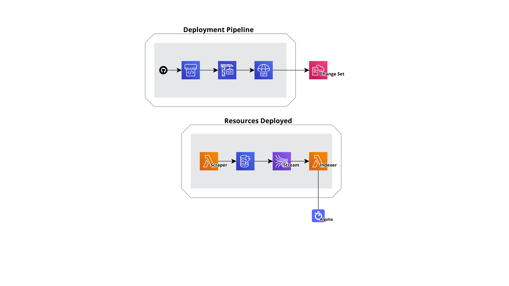

# Anify Infrastructure

Open Source Infrastructure designed to power [anify](https://github.com/anify-app/anify) 🔋.

## 📝 Architecture

Application is responsible for storing an anime in a DynamoDB table with downstream writes to Algolia.

The anime-scraper Lambda is responsible for writing the anime to DynamoDb, and the anime-indexer Lambda is responsible for indexing to Algolia.

## 🛫 CICD

CDK Pipelines let us automatically build, test, and deploy a new version of our stack from github.

Right now we are deploying to one Stage named "beta" with the base pipelines settings

## Diagram

## 👨‍💻 Maintainers

- [@m1yon](https://github.com/m1yon)
- [@ifielder](https://github.com/ifielder)
